# RMP Deimonyag

Repositorio principal de **Deimonyag**, robot seguidor de línea de competición con sistema de succión.

## Configuración actual

- ESP32-C3 Super Mini
- 12 × QRE1113GR + CD74HC4067
- 2 × IFX9201SG
- 2 × JSumo ProFast 12 V 3600 RPM
- EDF27 brushless + ESC
- LiPo 3S 450 mAh 75C XT30
- Matek MICRO BEC 6–30 V ajustado a 5 V
- MicroStart, botón de estrategia y LEDs indicadores

## Alimentación

- **VBAT / 3S:** motores de tracción y EDF/ESC
- **5 V:** Matek MICRO BEC → ESP32-C3 + LEDs IR de los QRE1113GR
- **3,3 V:** ESP32-C3 → CD74HC4067 + pull-ups de los QRE1113GR
- **GND:** común

## GPIO

| GPIO | Función |
|---:|---|
| 0 | MUX S3 |
| 1 | MUX S2 |
| 2 | MUX S1 |
| 3 | MUX S0 |
| 4 | MUX SIG / ADC |
| 5 | Motor 1 PWM |
| 6 | Motor 1 DIR |
| 7 | Motor 2 PWM |
| 8 | Motor 2 DIR |
| 9 | LED indicador |
| 10 | ESC / EDF27 |
| 20 | MicroStart |
| 21 | Botón de estrategia |

## Hardware — revisión 2026-09-12

### Main Board

[](hardware/previews/SCH_Deimonyag_1-Main_Board_2026-09-12.svg)

### Barra de 12 sensores

[](hardware/previews/SCH_Deimonyag_2-12_Sensor_2026-09-12.svg)

### PCB

- [PCB Top — PDF vectorial](hardware/previews/PCB_PCB1_2026-09-12_Top.pdf)
- [PCB Bottom — PDF vectorial](hardware/previews/PCB_PCB1_2026-09-12_Bottom.pdf)
- [Página completa de hardware](docs/HARDWARE.md)

Los SVG se pueden abrir y ampliar sin pérdida de calidad. Los PDF conservan el detalle vectorial de las PCB.

## Documentación

- [Conexiones actuales](docs/CONEXIONES.md)
- [Hardware](docs/HARDWARE.md)
- [Changelog](CHANGELOG.md)
- [Visor interactivo](docs/hardware-viewer.html) — preparado para GitHub Pages

## Estructura

```text
RMP_Deimonyag/
├── docs/
├── hardware/
│   ├── main-board/
│   ├── sensor-bar/
│   └── previews/
├── firmware/
├── cad/
├── bom/
└── media/
```

El objetivo es mantener en un único repositorio los esquemáticos, PCB, documentación, firmware, CAD, BOM y archivos de fabricación de Deimonyag.
